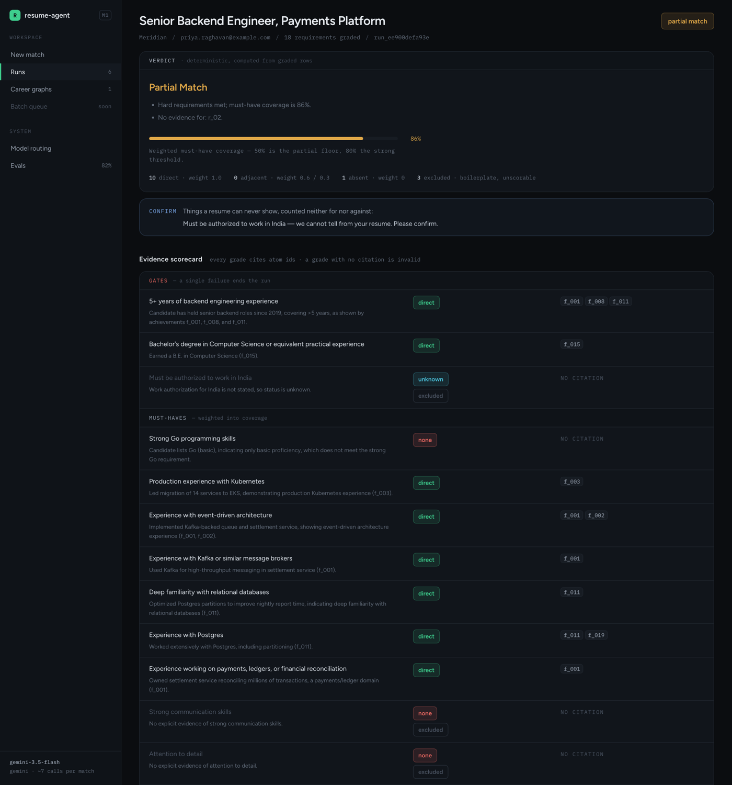
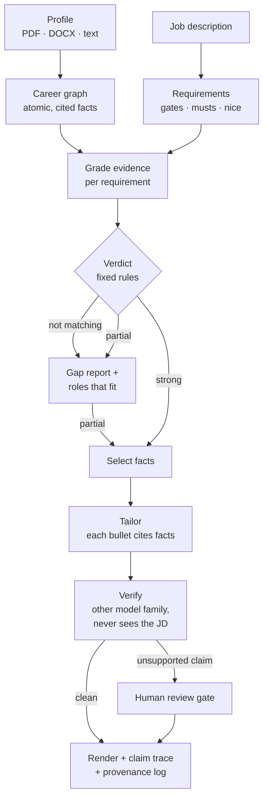
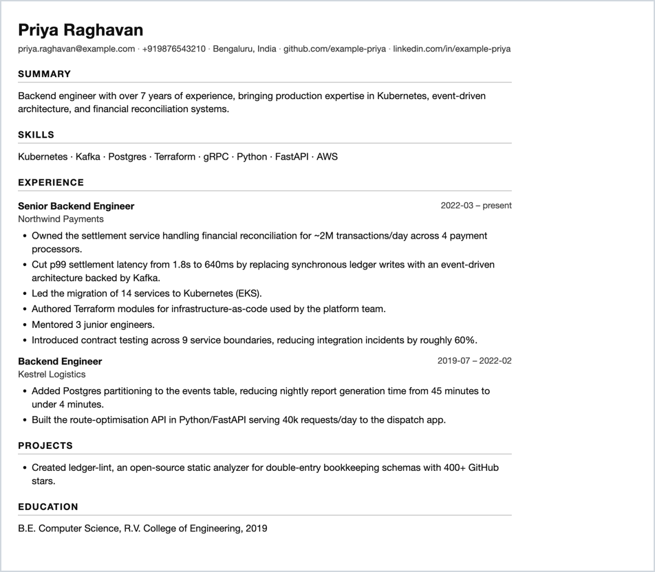

# resume-agent

[](https://github.com/MkRafa/resume-agent/actions/workflows/tests.yml)

**Tells a candidate whether they match a job, with cited evidence for every
requirement. When they do, it writes a tailored resume in which every claim
traces back to a fact they actually supplied, and then checks it twice.**



<sub>A live run on the synthetic sample profile. "Strong Go" grades `none`
because the candidate wrote "Go (basic)", so the verdict is a partial match,
not strong. Every grade cites the atomic facts (`f_001`…) it rests on.</sub>

## Results

Measured, not asserted. Each eval reports its failure modes separately,
because they cost the candidate different things.

| What | Result | How it's measured |
|---|---|---|
| **Match verdict** vs human labels | **18/22 agree (82%), 0 over-generous.** All 4 errors are on the cautious side | 22 hand-labelled profile × JD pairs · `gemini-3.5-flash` · Aug 2026 |
| **Fact-checker** catches fabrication | **0/12 fabrications missed, 0/11 truthful bullets blocked** | 23 hand-built pairs · `gpt-oss-120b` · Sep 2026 |
| **Claim tracing** on every resume | Numbers, tools, titles, dates and skills checked against their source facts, with no model involved | Runs on every render; caught a live resume leading with a skill the candidate rated "basic" |
| **Pipeline, store, web** | Unit and plumbing tests, **no API calls** | CI on every push |

The gold set is synthetic and small. These numbers are a floor, not proof. See
[Evaluation](#evaluation) for the confusion matrix and every known miss.

## How it works



Seven model calls per full run, with everything else in plain Python. Four
decisions do most of the work:

- **The verdict is computed, not generated.** The model grades evidence per
  requirement, and a fixed rule turns the grades into a verdict. That makes it
  explainable ("you failed r_02"), stable across runs and testable.
- **The fact-checker is adversarial, cross-family and blind to the job
  description.** A model checking its own family's writing shares its blind
  spots, and a checker that knows the target job rationalises stretches.
- **Anything computable is computed.** Years of experience, keyword coverage
  and claim tracing are all Python, because models get overlapping date ranges
  wrong in ways that look plausible.
- **Nothing ships unverified.** Unresolved claims block the render until a
  person accepts each one.

It is deliberately **not an agent loop**: a resume pipeline that takes a
different path each run is a bug. See [Agents](#agents) for what is and isn't
agentic here.

## Quickstart

```bash
python3 -m venv .venv && ./.venv/bin/pip install -r requirements.txt
cp .env.example .env    # add a free GEMINI_API_KEY and GROQ_API_KEY
./.venv/bin/uvicorn app.web:app --port 8000
```

Open <http://localhost:8000> and upload `data/profiles/sample_resume.md` with
`data/jds/sample_jd.md`. Both are synthetic. Keys are free, no card needed:
[Gemini](https://aistudio.google.com/apikey) and
[Groq](https://console.groq.com/keys).

Or from the CLI:

```bash
./.venv/bin/python cli.py --profile-file data/profiles/sample_resume.md --jd-file data/jds/sample_jd.md
```

Both sides accept `--profile-text` / `--profile-file` and `--jd-text` /
`--jd-file` (PDF, DOCX, TXT, MD). Pass `--email` or `--phone` when the document
has no contact details. Tests need no keys: `./.venv/bin/python -m pytest evals/ -q`.

**Status:** the pipeline (M0) and the web app with persistence and the human
review gate (M1) are built. Next is growing the gold set and the enrichment
interviewer (M2).

- [Architecture](#architecture): the full end-to-end map
- [Web app](#web-app) · [Evaluation](#evaluation) · [Known limitations](#known-limitations)
- [Gotchas already paid for](#gotchas-already-paid-for): the bugs, and why they happened

---

## Web app

One Python service holds the pipeline, the store and the UI. It is
server-rendered Jinja with vanilla JS polling: no build step and no JS
dependencies. The only external request is Google Fonts; offline, the UI falls
back to system fonts.

- **`/`**: paste or upload a profile and a JD (PDF, DOCX, TXT, MD)
- **`/runs/{id}`**: live progress, then the evidence scorecard, verdict, open
  questions, gaps and adjacent roles
- **the review gate**: when the verifier can't trace a claim, the resume is
  withheld until a person ticks each one. Unticked blockers keep it blocked.
- **`/profiles/{key}`**: the candidate's latest career graph and every
  application made against it



Runs execute in a worker thread (~7 model calls; 30–60s when providers are
healthy, several minutes when free-tier models are overloaded and failover
kicks in), with status persisted to SQLite so a refresh or a second browser
sees the same state.

Profiles are keyed by the email/phone rule with alternate-key lookup, so the
data model is multi-tenant before there is any login. Auth is a wrapper to add
later, not a migration.

## Architecture

### The shape of the thing

```
                        ┌─ typed text ─┐
  intake_profile ───────┤              ├──> Document ──> build_career_graph ──┐
                        └─ file ───────┘                  (LLM: extract)      │
                          pdf/docx/txt/md/img                                 │
                                                                              ├──> match
  intake_jd ────────────┤ same ├──────────> Document ──> parse_jd ────────────┘  (LLM: match)
                                                          (LLM: parse)            │
                                                                                  ▼
                                                              compute_verdict — deterministic
                                                                                  │
             ┌────────────────────────────────┼────────────────────────────────┐
             ▼                                ▼                                ▼
       not_matching                       partial                          strong
             │                                │                                │
        gap_report                       gap_report ───────────────────────────┤
        (LLM: gaps)                      (LLM: gaps)                           │
             │                                └────────────┬───────────────────┘
            END                                            ▼
                                                    select_facts   (LLM: rank)
                                                            ▼
                                                       tailor      (LLM: write)
                                                            ▼
                                                       verify      (LLM: refute — different
                                                            │       family, JD hidden)
                                            ┌───────────────┴───────────────┐
                                     blockers?                          clean
                                            │                               │
                              human review gate                          render
                              (M1 web UI / --accept-flags)          + ats_lint
                                            │                       + provenance
                                            └──────────────> render ────────> END
```

**Seven LLM calls per full run.** Everything else is Python.

Deterministic edges throughout. This is not an agent loop and shouldn't become
one — a resume pipeline that takes a different path each run is a bug, not a
feature. See [Agents](#agents) for the honest accounting of what is and isn't
agentic here.

### Four decisions that shape everything

**The Career Graph is the primitive, not the resume.** `app/schemas/career.py`
holds atomic fact atoms with stable ids. Tailoring is selection and rewriting
over those atoms, never re-expansion of an already-lossy resume PDF — you can't
recover what the PDF threw away. It's also the stable prompt prefix across every
application one candidate makes: keep it first in the prompt and providers with
caching make applications 2..n a fraction of the first.

**The verdict is deterministic Python, not a model score.** The model grades
evidence per requirement; `app/tools/verdict.py` turns those grades into a
verdict by fixed rule. That's what makes it explainable ("you failed r_02"),
stable across runs, and testable against a gold set. A 0–100 score from a model
gives you none of those three.

**The verifier is adversarial, cross-family, and blind to the JD.** It runs on a
different model family because a model asked to check its own work shares its
own blind spots. It never sees the job description — a verifier that knows what
the text was optimised for rationalises its stretches instead of catching them.
Context starvation is doing real correctness work.

**Anything computable is computed.** Years of experience, keyword coverage, page
budget, date ranges — all Python. LLMs get overlapping employment spans wrong in
ways that look entirely plausible.

### Framework choices

| Layer | Choice | Why |
|---|---|---|
| Orchestration | **LangGraph** | Typed state, explicit conditional edges, and — the reason it earns its place — checkpointing for the human review interrupt |
| Contracts | **Pydantic v2** | Schema at every node boundary; validation failures drive the model retry |
| Model routing | **LiteLLM** | One call path across Gemini / Groq / Ollama; swap providers by config, not code |
| Web | **FastAPI + Jinja** | One Python service. Vanilla JS polling — no build step, no JS dependencies |
| Store | **SQLite (WAL)** | Postgres-shaped schema; the worker thread and request thread both write |
| Eval | **pytest + JSONL** | Free, no vendor. `run_gold.py` adds a confusion matrix |

Deliberately **not** used: LangChain chains/agents (abstraction tax, and the
prompt *is* the product here), vector DBs (a whole career fits in context — RAG
would be complexity with no payoff), CrewAI/AutoGen (multi-agent chat is the
wrong shape for a deterministic pipeline).

---

### Nodes

Each is a plain function `state -> partial state update`, in `app/nodes/`.

| Node | Module | LLM | In → Out |
|---|---|---|---|
| `intake_profile` | `intake.py` | — | text/file → `Document` |
| `intake_jd` | `intake.py` | — | text/file → `Document` |
| `build_career_graph` | `extract.py` | `extract` | `Document` → `CareerGraph` + resolved `Identity` + computed years |
| `parse_jd` | `extract.py` | `parse` | `Document` → `JobSpec` (requirements, gates, vocabulary) |
| `match` | `matching.py` | `match` | graph + job → `Scorecard` rows, then deterministic verdict |
| `gap_report` | `matching.py` | `match` | weak rows → `Gap[]` + `adjacent_roles[]` |
| `select_facts` | `generate.py` | `tailor` | scorecard → ranked `fact_ids` within a page budget |
| `tailor` | `generate.py` | `tailor` | selected atoms → `TailoredResume` (bullets carry `fact_ids`) |
| `verify` | `generate.py` | `verify` | atoms + resume (**no JD**) → `VerifyReport` |
| `render` | `rendering.py` | — | resume → HTML/PDF + provenance log, gated on blockers |

`match` is also the **join** of the two parallel branches, so it's where an
upstream failure on either side is caught. Three guards live there: upstream
errors, an empty career graph, and a job spec with no gradable requirements —
each returns an error rather than a misleading verdict.

### Skills

A *skill* here is a versioned prompt module: instruction + output schema + model
binding, loaded from `app/skills/*.md` so prompts change without touching Python.
These are the highest-churn artifacts in the system — when quality moves, it
moves because one of these changed.

| Skill | Used by | The rule that matters most |
|---|---|---|
| `extract_profile.md` | `build_career_graph` | **Never invent.** No metric in the source → `metrics` stays empty. One claim per atom. Grade ownership honestly (`led`/`contributed`/`assisted`) — resume language inflates |
| `parse_jd.md` | `parse_jd` | `gate` only for genuine disqualifiers. "5+ years **required**" is a gate; "**preferred**" is a must. Split compound requirements. Flag boilerplate ("team player") so filler can't sink a candidate |
| `match_grader.md` | `match` | Grades `direct`/`adjacent`/`transferable`/`none`/`unknown`, each **citing atom ids**. A grade with no citation is invalid. A skills-list mention is a claim, not a demonstration. When torn, take the lower grade |
| `select_facts.md` | `select_facts` | Rank before writing, so the writer never pads. Coverage over redundancy; never leave a role with zero bullets |
| `tailor.md` | `tailor` | Every bullet carries its `fact_ids` and asserts nothing they don't contain. Don't lead the skills list with a qualified skill. Use the computed years figure, never the JD's minimum |
| `verify.md` | `verify` | Assume the resume is wrong until the facts show otherwise. **Specific→general is accurate** (EKS → "Kubernetes"), general→specific is not |
| `gap_report.md` | `gap_report` | Classify `dealbreaker`/`significant`/`coachable` honestly. On a hard no, name 3–5 roles this profile *would* fit — often the most useful output |

### Tools — the deterministic layer

`app/tools/`. Governing principle: **anything computable is computed, never
generated.** All unit-tested.

| Module | Functions | Notes |
|---|---|---|
| `identity.py` | `normalize_email`, `normalize_phone`, `resolve_identity`, `merge_identities` | Email primary, phone fallback. **Both retained as alternate keys** so a later upload with only one reconciles instead of forking a second profile. Gmail dots deliberately *not* canonicalised — wrongly merging two people is worse than failing to merge one |
| `dates.py` | `parse_month`, `years_of_experience`, `graph_years_of_experience` | Overlapping roles are **merged, not summed** — two concurrent jobs are 5 years, not 10. LLMs get this wrong plausibly |
| `documents.py` | `from_text`, `from_file`, `load_input` | PDF/DOCX/TXT/MD → one `Document`. Images are refused with a reason (no extraction path, and redaction cannot touch pixels). Detects a scanned PDF (empty text layer) instead of silently extracting 40 characters. Reads DOCX **tables** — resumes hide whole roles there |
| `keywords.py` | `keyword_coverage`, `resume_to_text` | Word-bounded matching ("Go" must not hit "Django"). Stuffing needs high density **and** ≥4 repetitions **and** a document long enough for density to mean anything |
| `verdict.py` | `compute_verdict`, `strongest_hooks` | The rule: any failed gate → `not_matching`; >2 absent musts → `not_matching`; ≥80% coverage with none absent → `strong`; ≥50% → `partial`. Boilerplate and unscorable categories leave the denominator |

### Hooks

Middleware around every model call, in `app/hooks/`. Kept as plain functions so
the call path in `models.py` stays readable end to end.

| Hook | When | What it does |
|---|---|---|
| `pii.redact` / `restore` | before / after every call | Swaps emails, phones and URLs for placeholders — including on the schema-retry path. Names can't be pattern-matched, so they are kept out of every prompt after extraction instead. Mitigation, **not** a compliance story — employment history is itself identifying |
| `models.validate_or_retry` | after every call | Pydantic parse; on failure, feeds the validation error back and retries once |
| `cost.log_cost` | after every call | Per-node token ledger. You want this before the first bill, not after |
| `guardrail.block_on_unresolved_flags` | before `render` | **Hard gate.** Raises `RenderBlocked` while any verifier blocker is unresolved. Structural, not a policy someone remembers |
| `audit.write_audit_log` | after `render` | Persists every cited claim → `fact_id` edge (summary, experience, projects) to `provenance.json`, flagging orphans |

### Agents

Honest accounting: **there are currently no agents in the strict sense** — no
component chooses its own tool sequence or loops until satisfied. Calling the
nodes "agents" would be marketing. Two components are agent-*shaped*:

- **The verifier** — runs on a different model family, in a deliberately starved
  context (no JD), with an adversarial instruction. Isolation is a correctness
  mechanism, not an implementation detail.
- **The document extractor** — a fallback ladder (text layer → ask the user
  to paste) rather than a single path. A multimodal rung for images and scans
  is designed but not built: it would send unredacted pixels to the provider.

The one genuinely agentic component in the *design* is the **enrichment
interviewer** (M2, not built): it decides which scorecard gaps are worth asking
about, phrases each question, judges whether the answer resolved the gap, and
stops on its own. It needs a hard turn cap or it will interview people forever.

### Model routing

`app/config.py` + `app/models.py`. Every call goes through `complete_json()`,
which is where the hooks hang.

```
extract   gemini-3.5-flash    cheap, structured output
parse     gemini-3.5-flash    low judgement
match     gemini-3.5-flash    highest-judgement node — first to upgrade on a paid key
tailor    gemini-3.5-flash    user-visible quality
verify    groq/gpt-oss-120b   DIFFERENT FAMILY, deliberately
```

Prompt layout is deliberate: `[system][career graph ← stable][JD ← varies]`.
The graph is identical across every application one candidate makes, so keeping
it first and unchanged makes it the cacheable prefix.

**The verifier has its own failover.** `MODEL_VERIFY_FALLBACKS` (empty in code,
`gpt-oss-20b` in `.env.example`); anything in it from the tailorer's family is
dropped. A model belongs there only after passing the verifier eval with zero
misses: `gpt-oss-20b` scored 0/12 misses, 1/11 false positives, 19/23 exact;
`qwen3.8-27b` was rejected for missing `flag_misattributed_merge`. Both are on
Groq, so this covers a rate-limited or overloaded model, not a Groq outage. The
reverse is enforced too: the tailorer's fallbacks skip the verifier's family,
so a rate-limited Gemini can never hand the writing to the model that checks it.

**Failover rotates models before sleeping.** Free-tier quotas are *per model*
("limit: 20, model: gemini-3.7-flash"), so when one is exhausted a sibling is
usually free. Sleeping on the primary first wastes a minute to learn what the
next model answers instantly. One full pass with no sleep, then back off
honouring the provider's own `retryDelay`.

**Output ceilings are per node** (`MAX_TOKENS_BY_NODE`). Too low truncates the
career graph mid-array; too high fails every Groq call, because Groq bills
`max_tokens` against your tokens-per-minute budget.

**The quota tracker is per-provider and self-clearing.** See
[Gotchas](#gotchas-already-paid-for) — the obvious implementation bricks the app.

### Data contracts

`app/schemas/` — Pydantic at every boundary.

| Schema | Key types |
|---|---|
| `career.py` | `FactAtom` (id, type, raw_text, skills, `Metric[]`, `Scope`, `evidence_strength`, `confidence`), `Identity`, `CareerGraph` |
| `job.py` | `Requirement` (kind: gate/must/nice/implicit, category, vocab, boilerplate), `JobSpec` |
| `match.py` | `ScorecardRow` (grade + `evidence_fact_ids` + rationale), `Gap`, `Scorecard`, `GRADE_WEIGHT`, `UNSCORABLE_CATEGORIES` |
| `resume.py` | `Bullet` (**text + fact_ids**), `ExperienceBlock`, `TailoredResume`, `VerifyFlag`, `VerifyReport` |
| `document.py` | `Document` (source_type, raw_text, extraction_method, confidence, warnings) |

`Bullet.fact_ids` is the single field that makes provenance, verification and
the audit log possible.

### Persistence & execution (M1)

`app/store.py` — SQLite in WAL mode, Postgres-shaped schema.

- `profiles` keyed by the identity rule; `profile_keys` maps every alternate key
  to one profile, so the data model is **multi-tenant before there is any login**
- `runs` holds the full state (career graph snapshot, job, scorecard, resume,
  verify report, artifacts) so a refresh or a second browser sees the same thing
- a profile holds the **latest** extraction — each run replaces it, and atom
  ids are reassigned every time. That is why each run keeps its own graph
  snapshot: a review approved later still renders against the facts that
  resume was written from. Merging extractions into one growing graph is M2
  work (it needs atom de-duplication and stable ids)
- `applications` is **deliberately unused** — outcome data ("did this get a
  reply?") is what tells you whether your verdicts are honest, and it cannot be
  backfilled

`app/runner.py` — runs take 30–60s, so they execute in a worker thread with
status transitions (`queued → running → needs_review → done/failed`) persisted
for polling. `resolve_and_render` handles the second half of the human review:
it calls the render node **directly** rather than re-invoking the graph, because
a fresh run would generate a *different* resume whose claims no longer match the
ones just accepted.

A restart orphans in-flight runs (the pool is in-process, and `--reload`
restarts on every save), so startup marks any `queued`/`running` run as
`failed · Interrupted` rather than leaving it spinning. Uploaded files are
deleted as soon as their run has read them — the extracted graph is what is
kept, and an uploaded resume is raw PII.

### Repository layout

```
app/
  graph.py         the whole pipeline, readable in one screen
  state.py         typed LangGraph state (note the append reducers)
  config.py        per-node model routing + fallback chain
  models.py        complete_json(): the single call path, where hooks hang
  preflight.py     credential check — a clear message, not a stack trace
  schemas/         Pydantic contracts at every node boundary
  skills/          versioned prompt modules — highest-churn artifacts
  nodes/           one file per stage
  tools/           deterministic; unit-tested
  hooks/           PII redaction, cost ledger, render guardrail, provenance
  templates/       ats_clean.html.j2 + web/ (Jinja UI)
  store.py         SQLite persistence, identity-keyed
  runner.py        background execution + status
  web.py           FastAPI routes
evals/
  test_*.py        unit, plumbing, store and web tests — no API calls
  run_gold.py      gold-set runner + confusion matrix
  gold/            22 labelled pairs, 8 profiles × 13 JDs (synthetic)
cli.py             the M0 entry point
data/              gitignored — never commit a real resume
```

## Evaluation

Five layers, cheapest first. Layers 1 and 5 run with **no API calls at all**.

| Layer | What it checks | Cost | Where |
|---|---|---|---|
| 1. Unit | Identity resolution, date math, keyword coverage, the verdict rule, the quota tracker, model routing, PII redaction, eval cache keys | free | `test_identity/dates/keywords/verdict/quota/config/pii/gold_cache.py` |
| 2. Plumbing | Fan-out, join, routing, render guardrail, provenance, intake errors, the store, the web review gate — models stubbed | free | `test_pipeline/documents/store/web/models.py` |
| 3. **Verdict agreement** | Does the grader match human labels? **The eval that matters** | ~43 calls cold | `run_gold.py`, `test_gold.py` |
| 4. **Verifier calibration** | Does the fact-checker catch fabrication without blocking truth? | 23 calls | `run_verifier.py` |
| 5. **Hallucination rate** | Can every claim on a generated resume be traced? | free | `app/tools/claim_trace.py` |

```bash
./.venv/bin/python -m pytest evals/ -q        # no API calls; gold tests skip
```

### Verifier eval

```bash
./.venv/bin/python evals/run_verifier.py
./.venv/bin/python evals/run_verifier.py --offline
```

23 hand-built `(facts, bullet)` pairs — 12 that must be flagged, 11 that must
not. The two failure modes are reported separately rather than rolled into one
accuracy figure, because they cost very different things:

- a **miss** puts a fabricated claim on a real job application
- a **false positive** blocks a truthful resume, and teaches the reviewer to
  tick every box without reading — silently turning the gate into a rubber stamp

**Current baseline (`gpt-oss-120b` on Groq, 2026-09-24, all 23 live):**

```
Misses            0 / 12     fabrication that would ship on a real resume
False positives   0 / 11     truthful resumes blocked
Exactly correct  19 / 23     right call AND right severity
```

The verifier moved to `gpt-oss-120b` because Groq retired
`llama-3.3-70b-versatile` — every run failed at the verify step.

Its first run scored one false positive, on `clean_merged_atoms` — and the
model was right. The fixture's bullet said "authoring *its* runbooks" (the
route-optimisation API's) while the source atom says the runbooks were for the
shipment and billing services: a merge that quietly transfers a fact between
atoms. Llama had let it through. The clean case now carries a faithful merge,
and the original bullet became a should-flag case, `flag_misattributed_merge` —
the subtlest fabrication in the set.

**Previous baseline (`llama-3.3-70b`, 2026-08-15, all 22 verified live):**

```
Misses            0 / 11     fabrication that would ship on a real resume
False positives   0 / 11     truthful resumes blocked
Exactly correct  18 / 22     right call AND right severity
```

Every fabrication caught — invented metrics, invented technologies,
`contributed`→"led" inflation, scale generalisation, general→specific
invention. The four non-exact results are all soft: two clean cases drew a
`warning` (which does not block), and two flagged cases were caught but
over-severe or given the wrong `issue` label.

False positives went **3 → 2 → 0** across a prompt restructure and then a
deterministic filter. Two of them resisted *three* revisions of `verify.md`
despite the prompt naming them with the exact example, which is the point at
which prompt engineering stops being the right tool:
`app/tools/verify_filter.py` enforces those two rules in Python instead. It only
ever downgrades `blocker` → `warning` — never suppresses a flag, never
escalates one — so a real fabrication cannot be filtered away.

The cache key includes the prompt text and the model id. Without that, editing
`verify.md` replays stale output and reports the old behaviour as the new one.
The cache holds the model's **raw** output; `verify_filter.py` is applied at
scoring time, so a filter change shows up immediately, `--offline` included.

### Claim tracing (layer 5)

The deterministic counterpart to the verifier, and deliberately built to fail
differently — having one model check another's output is circular, since they
share training and blind spots, and a fabrication both find plausible sails
through. These are arithmetic and set-membership checks:

| Check | Catches |
|---|---|
| `orphan_bullet` | a bullet (or the summary) citing no facts at all |
| `dangling_citation` | a `fact_id` that does not exist |
| `unsourced_number` | a figure absent from the cited atoms and not derivable from them |
| `unsourced_technology` | a named tool absent from the cited atoms |
| `unsourced_header` | a role title, company or date range no cited atom carries — title inflation |
| `overstated_skill` | a skill the candidate qualified ("Go (basic)") and nothing demonstrates, listed bare or leading the skills line |

Every section is traced: experience and project bullets against their own
citations, the summary against `summary_fact_ids` (it may state the computed
years figure), and the uncited skills list and education lines against the
whole graph. Tool names that are also English words (`Go`, `Spark`, `Chef`…)
only count when written as a proper noun, so "go-to-market" is not an invented
language.

Numbers are the highest-signal check: a fabricated metric is the most damaging
and most checkable thing a resume can contain. Percentages derived from stated
figures are allowed — "1.8s to 640ms" genuinely supports "cut latency 64%" —
and the specific→general technology forms match the verifier's rules, so EKS →
"Kubernetes" is not a hallucination here either.

It runs on **every render**, not just in evals, writing `untraced_claims.json`
alongside the resume when anything fails to trace.

**Measured (2026-08-15): 27 bullets across 3 generated resumes, 0 untraceable.**
A clean result, but a small sample on synthetic profiles — the number to watch
as the corpus grows, not yet evidence of a solved problem. It was also measured
over bullets only: re-tracing the one stored web run with the full-coverage
check found its bullets clean but its **skills list** leading with `Go` and
`Postgres`, neither of which its (truncated, 3-atom) career graph contains.

### The gold set

The eval that actually matters. 22 hand-labelled `(profile, JD)` pairs built
from 8 synthetic candidates against 13 job descriptions — the same candidate
appears against several roles, so the set tests *discrimination*, not just
recognition (Dev is a `strong_match` for the research role and `not_matching`
for the production MLE role; Priya is strong for the Python payments role and
partial for the Go one).

```bash
./.venv/bin/python evals/run_gold.py                 # confusion matrix
./.venv/bin/python evals/run_gold.py --offline       # no API calls at all
./.venv/bin/python evals/run_gold.py --resume        # after a quota stop
./.venv/bin/python evals/run_gold.py --only priya_x_meridian_go
RUN_GOLD=1 ./.venv/bin/python -m pytest evals/test_gold.py -v   # same, in CI
```

Three things keep this affordable on a free tier:

1. **It stops at the verdict** — 3 calls per case, not 7. Tailoring and
   verification are a separate concern with their own eval.
2. **Extractions and JD parses are cached by content hash**, so 8 profiles
   across 22 cases costs 8 extractions, not 22. Every key includes the fixture,
   the prompt that produced it and the model id, and scorecard rows are keyed
   on the extracted graph and parsed job — so editing any prompt or switching
   `MODEL_*` invalidates exactly what it affects instead of replaying stale
   output as if it were new.
3. **Scorecard rows are cached separately from the verdict.** The verdict is
   deterministic Python over those rows, so every change to a threshold, to
   gate handling, or to the unknown/unscorable logic re-scores the whole set
   **instantly and for free** via `--offline`. Only a change to the *grader
   prompt* genuinely needs models again.

22 cases ≈ 43 calls cold, 22 warm, 0 offline. Results append to
`.cache/results.jsonl` as each case lands, so a run killed by a rate limit
keeps everything it finished — `--resume` picks up where it stopped.

Each case carries a `tests` field naming what it probes. Several are deliberate
traps that earlier versions failed:

| Case | Trap |
|---|---|
| `priya_x_meridian_go` | "Go (basic)" in a skills list must not satisfy "strong Go" |
| `rohan_x_junior_frontend` | "degree OR equivalent (bootcamps welcome)" must not fail a bootcamp grad |
| `arjun_x_senior_frontend` | "5+ years **preferred**" is a must-have, not a gate |
| `kavya_x_meridian_go` | deep payments domain must not carry a PM into an engineering role |
| `meera_x_ml_engineer` | data engineering is not ML engineering, even next to an ML team |
| `imran_x_appsec` | profile has **no email** — key must fall back to the E.164 phone |
| `priya_x_platform_sre` | threshold probe: sits near the partial/not-matching cutoff |

Error weighting is asymmetric on purpose: over-generous verdicts fail the
build, over-strict ones xfail. Sending a candidate into an application they
cannot win costs them more than an arguable rejection they can inspect.

### Current baseline — 2026-08-15, `gemini-3.5-flash`

```
expected \ actual    no   partial  strong        Agreement      18/22 (82%)
no                   10      ·        ·          Over-generous   0
partial               2      2        ·          Over-strict     4
strong                ·      2        6          Errored         0
```

**Every error is in the conservative direction.** Nothing was sent to a
candidate as a strong match that wasn't one — the failure mode that costs them
an application and their trust never fired.

The first run of this set scored **59%** with 9 over-strict verdicts. One cause
dominated: 13 of 14 `location` gates failed, because "Must be located in India
(Remote)" grades `unknown` — no resume states willingness to relocate. Adding
`location` to `UNSCORABLE_CATEGORIES` took it to 82%, re-scored offline from
cached grades at zero API cost.

The remaining four are margin cases, not bugs: two sit 3–4 points under a
threshold (77% vs 80%, 46% vs 50%), one has a genuinely unevidenced must-have,
and one is a label worth re-examining (`meera_x_stellar_python` fails a "5+
years **backend**" gate on 6 years of *data* engineering — the same
discipline-specific reasoning already accepted for `priya_x_platform_sre`).

**Thresholds have deliberately not been tuned to close that gap.** Moving a
cutoff to fit four cases out of 22 is overfitting, and it would trade away the
zero-over-generous property that matters most.

**Known gap:** only 5 of 22 cases are `partial_match`, the hardest class — and
3 of the 4 remaining errors involve it. Weight new cases toward it.

Fixtures are synthetic — never commit a real person's resume.

## Gotchas already paid for

- **`unknown` must not be a universal gate bypass.** Excusability is a property
  of the *requirement's category* (work authorization is never on a resume),
  never of what the model chose to answer. When a bare `unknown` cleared a gate,
  a local 7B graded "Bachelor's degree in CS" as unknown — for a resume that
  plainly listed one — and walked through. Any model could have done the same to
  any gate.
- **A quota latch must be per-provider and self-clearing.** A global one meant an
  exhausted Gemini key also blocked local Ollama calls, and since a tripped
  latch refuses to call, it could never see a success to reset — permanently
  bricked until process restart.
- **Groq bills `max_tokens` against your TPM budget**, so a generous blanket
  ceiling fails every call before it runs. Size ceilings per node.
- **Free-tier quota is per model, per day** (Gemini: 20/day/model; one match is
  ~7 calls). Rotate across models *before* sleeping — sleeping on the primary
  wastes a minute to learn what a sibling answers instantly.
- **A degenerate extraction must fail loudly.** A JD that parsed into zero
  requirements used to score `strong_match` — with no must-haves, coverage is
  trivially 100% and no gate can fail, so *a failed parse looked like a perfect
  candidate*. `match` now rejects an empty career graph or a requirement-less
  job spec before any verdict is computed. Found by pointing the pipeline at a
  weak local model that returned an empty requirements list.
- **Work-authorization gates reject everyone.** "Must be authorized to work in
  India" appears in most postings and no resume states it, so grading it `none`
  failed the gate for a candidate living and working there. Hence the `unknown`
  grade and `UNSCORABLE_CATEGORIES`.
- **The tailorer copied the JD's minimum years** as the candidate's experience —
  writing "5 years" for someone with 7.0. The prompt showed the employer's
  requirement but never the candidate's computed figure.
- **`notes` and `errors` need append reducers.** The profile and JD branches run
  in parallel and both write them; without reducers LangGraph raises
  `InvalidUpdateError`. Nodes return only their *new* entries.
- **Node modules must not share a name with the function they export.**
  `match.py` exporting `match` gets shadowed in `app/nodes/__init__.py`, making
  it unpatchable in tests. Hence `matching.py` / `rendering.py`.
- **Redaction must survive the retry path.** The schema retry appended the
  model's output *after* placeholders were restored, so the second request
  carried the real email and phone. Anything derived from restored text that
  goes back to a provider must be re-redacted.
- **Failover can quietly undo cross-family verification.** Guarding the
  verifier against Gemini fallbacks is half of it: with the verifier's own
  model in `MODEL_FALLBACKS`, a rate-limited Gemini handed the *writing* to
  the model that then checked it. Independence has to be enforced in both
  directions, by family, not by exact id.
- **A cache key must include what produced the output.** Keying eval caches
  on the fixture alone replays the previous prompt's output as the new
  prompt's result — and caching *after* a deterministic filter hides every
  later change to that filter.
- **`.gitignore` cannot re-include a file inside an ignored directory.**
  `data/` with `!data/profiles/sample_*` silently shipped no samples; it has to
  be `data/*` and a negation per level.
- **Don't route to `END` per-branch before a join.** The healthy branch still
  triggers the join node, which then reads a key the failed branch never wrote.
  The abort check belongs at the join.

## Privacy

Resumes are dense PII. `REDACT_PII=true` swaps emails, phones and URLs for
placeholders before every model call and restores them after, retries
included. Names cannot be pattern-matched, so the extractor necessarily sees
the name in the source document; no prompt after that includes it. But
employment history is itself identifying, and **free provider tiers generally
train on inputs**. Fine for synthetic data and your own resume; not acceptable
once real users upload theirs. Move to a no-training tier before M1 launches.
For fully local extraction, point `MODEL_EXTRACT` at an Ollama model.

## Next

**Calibration — the baseline exists now (82%, 0 over-generous).** Next: grow
the gold set toward ~30 pairs weighted to `partial_match` (3 of the 4 remaining
errors involve it). The verifier eval (22 pairs) and claim tracing now exist
too — grow the verifier set alongside, since 22 cases at 0/0 is a floor, not
proof.

**Then, in rough order:**

- **Enrichment interviewer** (M2) — the one genuinely agentic component. Reads
  scorecard gaps, asks 3–5 targeted questions, writes answers back as
  `user_claimed` atoms. This is what makes a returning user's second
  application better than their first, and it's the retention story.
- **Real `interrupt()` + checkpointer** — replace the M1 re-entry into `render`
  with a LangGraph interrupt over a Postgres checkpointer. The routing shape in
  `graph.py` is already correct for the swap.
- **Provenance in the resume UI** — hover a bullet, see its source atom.
  The data is already logged; only the UI is missing.
- **Auth + Postgres** — the store is already keyed and Postgres-shaped, so this
  is a wrapper, not a migration.
- **Batch mode** — paste 30 JDs, rank by fit. Cheap once the graph is cached,
  and it's the feature that saves the most applicant time.
- **Outcome tracking** — the `applications` table exists and is unused. Logging
  replies is what eventually tells you whether the verdicts are honest.

## Known limitations

- **Grader calibration: 82% agreement, 0 over-generous** (22 cases,
  `gemini-3.5-flash`, 2026-08-15). Good enough to build on; not yet good enough
  to trust unsupervised. See the confusion matrix above.
- **Verifier: 0/12 misses, 0/11 false positives** on 23 hand-built pairs
  (`gpt-oss-120b`), with two false-positive classes enforced in Python rather
  than the prompt. A small set — see [Verifier eval](#verifier-eval).
- **Images and scanned PDFs are not read.** Images are refused; a scan is
  detected and the user asked to paste text. A multimodal rung would send
  unredacted pixels to the provider, so it is a decision, not a default.
- **Free tier is the binding constraint** — Gemini allows 20 requests/day/model
  and one match is ~7 calls, so ~3 runs/day. Pro models 429 immediately, which
  is why `match` runs on Flash despite being the highest-judgement node.
- **Local Ollama mode compromises the verifier** — every node on one model means
  it's no longer cross-family, which is the whole point of the pass. Local runs
  are a plumbing check, not a quality signal.
- **No auth**, so anyone reaching the port can read every profile. Fine on
  localhost; not a deployment.
